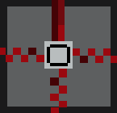
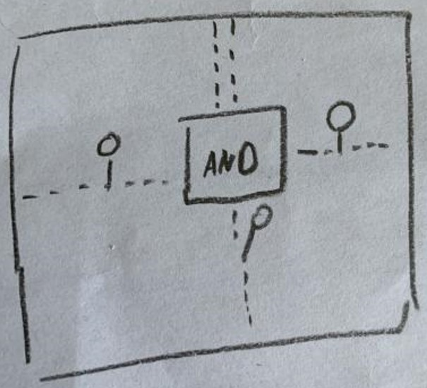
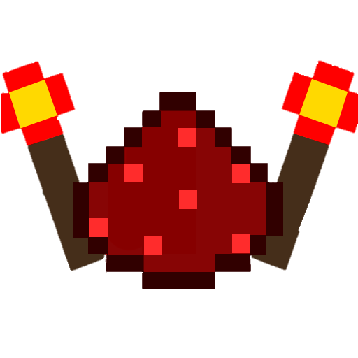

<body>
    

        <nav>
            <table class="header" style="font-family: 'Cabin Sketch', cursive;">
                <tr>
                    <td class="logo"></td>
                    <td class="savespace"></td>
                    <td>
                        <ul class="nav-links">
                            <li class="header" id="active"><a class="active" href="">Home</a></li>
                            <li class="header"><a href="http://meinkraft-logik-gatter.xobor.de/">Forum</a></li>
                            <li class="header"><a href="">Download</a></li>
                            <li class="header"><a href="">Wiki</a></li>
                            <li class="header"></li>
                        </ul>
                    </td>
                    <td>
                        

                            

                            

                            

                        

                    </td>
                    <td>
                        

                            <form id="search" method="get" action="ForumHub.html" >
                                <input type="search" name="q" id="suchbegriff" placeholder="Suchbegriff" class="mcButton" style="text-shadow: none;" />
                                <input type="submit" value="Search" class="mcButton" />
                            </form>
                        

                    </td>
                </tr>
            </table>
        </nav>
    

    <article>
        

            
             

            
             

            
             

            
             

            
              
        

        

            
MeinKraft-Logik-Gatter

            
<i>hilft dir komplexe Logik-Gatter einfach und kompakt in Minecraft zu bauen</i>

            

            

            

                

                        

                        <!---->
                

                

                     <h2 style="font-family: 'Cabin Sketch', cursive;">Das Logik-Gatter</h2>
                     

                        Das Logik-Gatter berechnet mit Hilfe von Logikchips die Redstone-Ausgabe. Das Logik-Gatter berechnet mit Hilfe von Logikchips die Redstone-Ausgabe.
                        Das Logik-Gatter berechnet mit Hilfe von Logikchips die Redstone-Ausgabe. Das Logik-Gatter berechnet mit Hilfe von Logikchips die Redstone-Ausgabe.
                     

                

                 
            

            

                

                    
                

                

                    <h2 style="font-family: 'Cabin Sketch', cursive;">Bau dir deine passende Schaltung</h2>
                    

                        Das ist der Tisch, auf dem man die Logik-Plug-Ins erstellen kann. Je nach Gatter werden verschiedene Materialien benötigt.
                        Außerdem können Input- und Output-Chips erstellt werden, um die Gatter zu konfigurieren.
                    

                

            

            

                

                    
                

                

                    <h2 style="font-family: 'Cabin Sketch', cursive;">Mit eingebautem Tutorial</h2>
                    

                        Wenn du eine Welt generierst, wirst du ein Buch erhalten in dem alle Logik-Gatter erklärt werden und alle Rezepete aufgelistet sind.
                        Dieses Buch unterstützt dich bei deinen Anfängen in der neuen Redstone-Welt.
                    

                

            

            

                

                    
                

                

                    <h2 style="font-family: 'Cabin Sketch', cursive;">Test</h2>
                    

                        In diesem Block steht noch nicht fest, was erscheinen wird.
                    

                

            

             
            

                
            

        

    </article>

    

        

            <a style="text-align: center;" href="#" class="mcButton">Impressum</a>
        

        

            
        

        

            <ul class="footer">
                <li class="footer"></li>
                <li class="footer"></li>
                <li class="footer"></li>
            </ul>
        

    

    
    
    
    
</body>