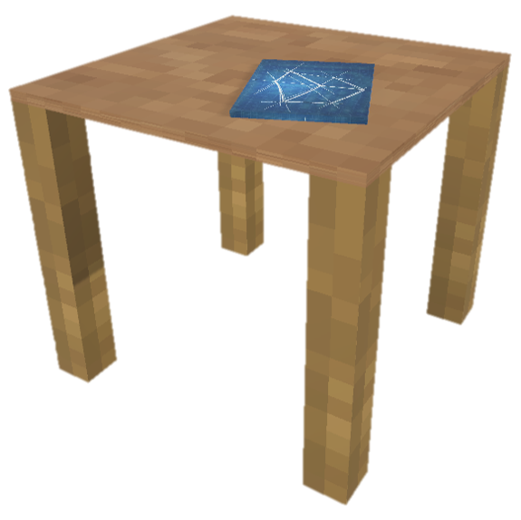
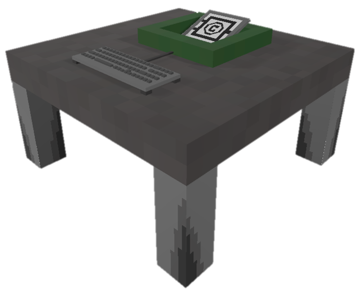

<body>
    

        <nav>
            <table class="header" style="font-family: 'Cabin Sketch', cursive;">
                <tr>
                    <td class="logo"></td>
                    <td class="savespace"></td>
                    <td class="nav-td">
                        <ul class="nav-links">
                            <li class="header" id="active"><a class="active" href="">Home</a></li>
                            <li class="header"><a href="http://meinkraft-logik-gatter.xobor.de/">Forum</a></li>
                            <li class="header"><a href="">Download</a></li>
                            <li class="header"><a href="wiki_home.html">Wiki</a></li>
                            <li class="savespace"></li>
                            <li class="header"></li>
                        </ul>
                    </td>
                    <td>
                        

                            

                            

                            

                        

                    </td>
                    <td>
                        

                            <form id="search" method="get" action="ForumHub.html" >
                                <input type="search" name="q" id="suchbegriff" placeholder="Suchbegriff" class="mcButton" style="text-shadow: none;" />
                                <input type="submit" value="Search" class="mcButton" />
                            </form>
                        

                    </td>
                </tr>
            </table>
        </nav>
    

    <article>
        

            
             

            
             

            
             

            
             

            
              
        

        

            
<a href="https://github.com/Gnuhry/PM_TINF19AI2" target="_blank">GitHub-Projekt</a>

            <ul class="gitHub">
                <li></li>
                <li></li>
                <li></li>
                <li></li>
                <li></li>
            </ul>
        

        

            
MeinKraft-Logik-Gatter

            
<i>hilft dir komplexe Logik-Gatter einfach und kompakt in Minecraft zu bauen</i>

            

            

            

                

                
                <video width="100%" height="100%" id="logicVideo" autoplay autoload muted loop onmouseout="glowingOffLogic();">
                    <source src="videos/animated_glowing_logicBlock2.mp4" type="video/mp4">
                </video>         
                    

                

                     <h2 style="font-family: 'Cabin Sketch', cursive;">Das Logik-Gatter</h2>
                     

                        Der Logik-Gatter-Hub kompremiert komplexe Logik-Schaltungen auf die Größe eines Blocks. Mit Hilfe von Erweiterungskarten kann man Inputs und Outputs einstellen. Außerdem ermöglich eine Logik-Erweiterungskarte dem Block eine Logik zu übergeben, die je nach Input einen Output berechnet.
                     

                

                 
            

            

                

                    
                    <video width="100%" height="100%" id="flipflopVideo" autoplay autoload muted loop onmouseout="glowingOffFlip();">
                        <source src="videos/animated_flipflop.mp4" type="video/mp4">
                    </video> 
                

                

                    <h2 style="font-family: 'Cabin Sketch', cursive;">Der Flip-Flop-Block</h2>
                    

                        Das Flip-Flop-Hub implementiert die möglichkeit Redstonesigale in einem Block zu speichern. Diese können über einen Set-Input gesetzt werden, über einen Reset-Input zurückgesetzt werden und die Clock taktet den Flip-Flop-Hub, sodass bei einem bestimmen Zustand ein Output ausgegeben wird.
                    

                

            

            

                

                    
                    <video width="100%" height="100%" id="tutotialVideo" autoplay autoload muted loop onmouseout="glowingOffWork();">
                        <source src="videos/animated_workbench.mp4" type="video/mp4">
                    </video> 
                

                

                    <h2 style="font-family: 'Cabin Sketch', cursive;">Workbench</h2>
                    

                        <b>Bau dir deine eigene Schaltung</b> 
                        In der Workbench werden aus Kabeln, Pins, Speicherkarten und Widerständen Logik- und Flip-Flop-Erweiterungskarten erstellt. 
                    

                

            

            

                

                    
                    <video width="100%" height="100%" id="testVideo" autoplay autoload muted loop onmouseout="glowingOffCode();">
                        <source src="videos/animated_codebench.mp4" type="video/mp4">
                    </video> 
                

                

                    <h2 style="font-family: 'Cabin Sketch', cursive;">Test</h2>
                    

                        In der Codebench kann man anhand einer aussagenlogischen Formel auf einer Custom-Erweiterungskarte eine Logik speichern, die vom Logik-Gatter-Hub ausgelesen werden kann.
                        Die Logik ist dabei nur durch  drei Eingänge und einen Ausgang begrenzt.
                    

                

            

             
            

                
            

        

    </article>
    

        

<a href="https://github.com/Gnuhry/PM_TINF19AI2" target="_blank">GitHub-Projekt</a>

        

            <ul class="gitHub">
                <li></li>
                <li></li>
                <li></li>
                <li></li>
                <li></li>
            </ul>
        

    

    

        

            <a style="text-align: center;" href="impressum_wiki.html" class="mcButton">Impressum</a>
        

        

            
        

        

            <ul class="footer">
                <li class="footer"></li>
                <li class="footer"></li>
                <li class="footer"></li>
            </ul>
        

    

    
    
</body>